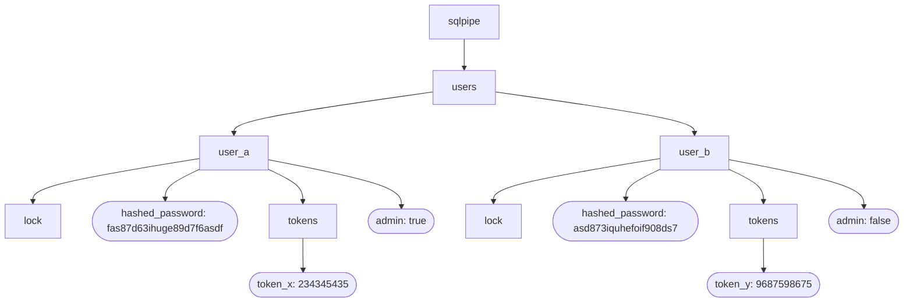

# sqlpipe route, data model, and locks planning

## create initial user
- etcd transaction
    - if
        <!-- business logic check -->
        - check that target user main node does not exist
    - then
        - create target user
    - else
        <!-- business logic checks -->
        - read target user node
- check if txn succeeded
    - if not
        - for responses
            <!-- business logic checks -->
            - target user main node
                - if exists, error duplicate username
            <!-- panic -->
            - panic("an unknown error occured while creating a user")
- return the user

## create a user
`POST /v2/users`
- etcd transaction
    - if
        <!-- authenticate calling user -->
        - check if calling user token exists
        - check if calling user token has expired
        <!-- authorize / check integrity of calling user-->
        - check if calling user main node exists
        - check if calling user password node exists
        - check if calling user admin node is true
        <!-- business logic check -->
        - check that target user main node does not exist
    - then
        - create target user
    - else
        <!-- authentication checks -->
        - read calling user token
        - read calling user main node
        <!-- corruption / permissions checks -->
        - read calling user password node
        - read calling user admin node
        <!-- business logic checks -->
        - read target user node
- check if txn succeeded
    - if not
        - for responses
            <!-- authentication checks -->
            - calling user token
                - if not exists, error invalid credentials
                - if expired, error expired auth token
            - calling user main node
                - if not exists, error invalid credentials
            <!-- corruption / permission checks -->
            - calling user password node
                - if not exists, error corrupt user
            - calling user admin node
                - if not exists, error corrupt user
                - if not true, error invalid permissions
            <!-- business logic checks -->
            - target user main node
                - if exists, error duplicate username
            <!-- panic -->
            - panic("an unknown error occured while creating a user")
- return the user

## show a user
`GET /v2/users/<username>`
- etcd transaction
    - if
        <!-- authenticate calling user -->
        - check if calling user token exists
        - check if calling user token has expired
        <!-- authorize / check integrity of calling user-->
        - check if calling user main node exists
        - check if calling user password node exists
        - check if calling user admin node is true
        <!-- business logic check -->
        - check if target user main node exists
    - then
        - read target user
    - else
        <!-- authentication checks -->
        - read calling user token
        - read calling user main node
        <!-- corruption / permissions checks -->
        - read calling user password node
        - read calling user admin node
        <!-- business logic checks -->
        - read target user main node
- check if txn succeeded
    - if not
        - for responses
            <!-- authentication checks -->
            - calling user token
                - if not exists, error invalid credentials
                - if expired, error expired auth token
            - calling user main node
                - if not exists, error invalid credentials
            <!-- corruption / permission checks -->
            - calling user password node
                - if not exists, error corrupt user
            - calling user admin node
                - if not exists, error corrupt user
                - if not true, error invalid permissions
            <!-- business logic checks -->
            - target user main node
                - if not exists, error record not found
            <!-- panic -->
            - panic("an unknown error occured while getting a user")
- return the user

## list all users
`GET /v2/users?<filter/pagination>`
- etcd transaction
    - if
        <!-- authenticate calling user -->
        - check if calling user token exists
        - check if calling user token has expired
        <!-- authorize / check integrity of calling user-->
        - check if calling user main node exists
        - check if calling user password node exists
        - check if calling user admin node is true
    - then
        - read users
    - else
        <!-- authentication checks -->
        - read calling user token
        - read calling user main node
        <!-- corruption / permissions checks -->
        - read calling user password node
        - read calling user admin node
- check if txn succeeded
    - if not
        - for responses
            <!-- authentication checks -->
            - calling user token
                - if not exists, error invalid credentials
                - if expired, error expired auth token
            - calling user main node
                - if not exists, error invalid credentials
            <!-- corruption / permission checks -->
            - calling user password node
                - if not exists, error corrupt user
            - calling user admin node
                - if not exists, error corrupt user
                - if not true, error invalid permissions
            <!-- panic -->
            - panic("an unknown error occured while listing users")
- calculate metadata / pagination on the server
- return the users

## update a user's password
`PATCH /v2/users/password`
- lock user
- etcd transaction
    - if
        <!-- authenticate calling user -->
        - check if calling user token exists
        - check if calling user token has expired
        <!-- check integrity of calling user-->
        - check if calling user main node exists
        - check if calling user password node exists
        - check if calling user admin node is true
    - then
        - update calling user password
        - delete calling user tokens
    - else
        <!-- authentication checks -->
        - read calling user token
        - read calling user main node
        <!-- corruption check -->
        - read calling user password node
        - read calling user admin node
- check if txn succeeded
    - if not
        - for responses
            <!-- authentication checks -->
            - calling user token
                - if not exists, error invalid credentials
                - if expired, error expired auth token
            - calling user main node
                - if not exists, error invalid credentials
            <!-- corruption check -->
            - calling user password node
                - if not exists, error corrupt user
            - calling user admin node
                - if not exists, error corrupt user
            <!-- panic -->
            - panic("an unknown error occured while updating a user's password")
- return the user
- unlock user

## update a user's admin status
`PATCH /v2/users/admin/<username>`
- lock user
- etcd transaction
    - if
        <!-- authenticate calling user -->
        - check if calling user token exists
        - check if calling user token has expired
        <!-- authorize / check integrity of calling user-->
        - check if calling user main node exists
        - check if calling user password node exists
        - check if calling user admin node is true
        <!-- business logic check -->
        - check if target user main node exists
    - then
        - update target user admin
        - delete target user tokens
    - else
        <!-- authentication checks -->
        - read calling user token
        - read calling user main node
        <!-- corruption / permissions checks -->
        - read calling user password node
        - read calling user admin node
        <!-- business logic checks -->
        - read target user main node
- check if txn succeeded
    - if not
        - for responses
            <!-- authentication checks -->
            - calling user token
                - if not exists, error invalid credentials
                - if expired, error expired auth token
            - calling user main node
                - if not exists, error invalid credentials
            <!-- corruption / permission checks -->
            - calling user password node
                - if not exists, error corrupt user
            - calling user admin node
                - if not exists, error corrupt user
                - if not true, error invalid permissions
            <!-- business logic checks -->
            - target user main node
                - if not exists, error record not found
            <!-- panic -->
            - panic("an unknown error occured while updating a user's admin status")
- return the user
- unlock user

## delete a user
`DELETE /v2/users/<username>`
- lock user
- etcd transaction
    - if
        <!-- authenticate calling user -->
        - check if calling user token exists
        - check if calling user token has expired
        <!-- authorize / check integrity of calling user-->
        - check if calling user main node exists
        - check if calling user password node exists
        - check if calling user admin node is true
    - then
        - delete user prefix
    - else
        <!-- authentication checks -->
        - read calling user token
        - read calling user main node
        <!-- corruption / permissions checks -->
        - read calling user password node
        - read calling user admin node
- check if txn succeeded
    - if not
        - for responses
            <!-- authentication checks -->
            - calling user token
                - if not exists, error invalid credentials
                - if expired, error expired auth token
            - calling user main node
                - if not exists, error invalid credentials
            <!-- corruption / permission checks -->
            - calling user password node
                - if not exists, error corrupt user
            - calling user admin node
                - if not exists, error corrupt user
                - if not true, error invalid permissions
            <!-- panic -->
            - panic("an unknown error occured while deleting a user")
- return how many nodes were deleted
- unlock user

## create a token
`POST /v2/tokens`
- lock the calling user
- etcd transaction
    - if
        <!-- integrity check -->
        - check if main user node exists
        - check if password node exists
        - check if admin node exists
    - then
        - read password node
    - else
        - read user main node
        - read password node
        - read admin node
- check if txn succeeded
    - if not
        - for responses
            <!-- corruption checks -->
            - main use node
                - if not exists, error invalid credentials
            - password node
                - if not exists, error corrupt user
            - admin node
                - if not exists, error corrupt user
            <!-- panic -->
            - panic("an unknown error occured while creating a user")
- check password on server with bcrypt
    - if fails: error invalid credentials
- insert the token
- return the token
- unlock the user

## check for corrupt users
`GET /v2/users/corrupt`
- etcd transaction
    - if
        <!-- authenticate calling user -->
        - check if calling user token exists
        - check if calling user token has expired
        <!-- authorize / check integrity of calling user-->
        - check if calling user main node exists
        - check if calling user password node exists
        - check if calling user admin node is true
    - then
        - read users
    - else
        <!-- authentication checks -->
        - read calling user token
        - read calling user main node
        <!-- corruption / permissions checks -->
        - read calling user password node
        - read calling user admin node
- check if txn succeeded
    - if not
        - for responses
            <!-- authentication checks -->
            - calling user token
                - if not exists, error invalid credentials
                - if expired, error expired auth token
            - calling user main node
                - if not exists, error invalid credentials
            <!-- corruption / permission checks -->
            - calling user password node
                - if not exists, error corrupt user
            - calling user admin node
                - if not exists, error corrupt user
                - if not true, error invalid permissions
            <!-- panic -->
            - panic("an unknown error occured while finding corrupt")
- check for corrupt users on the server
- return the users

## data model example

